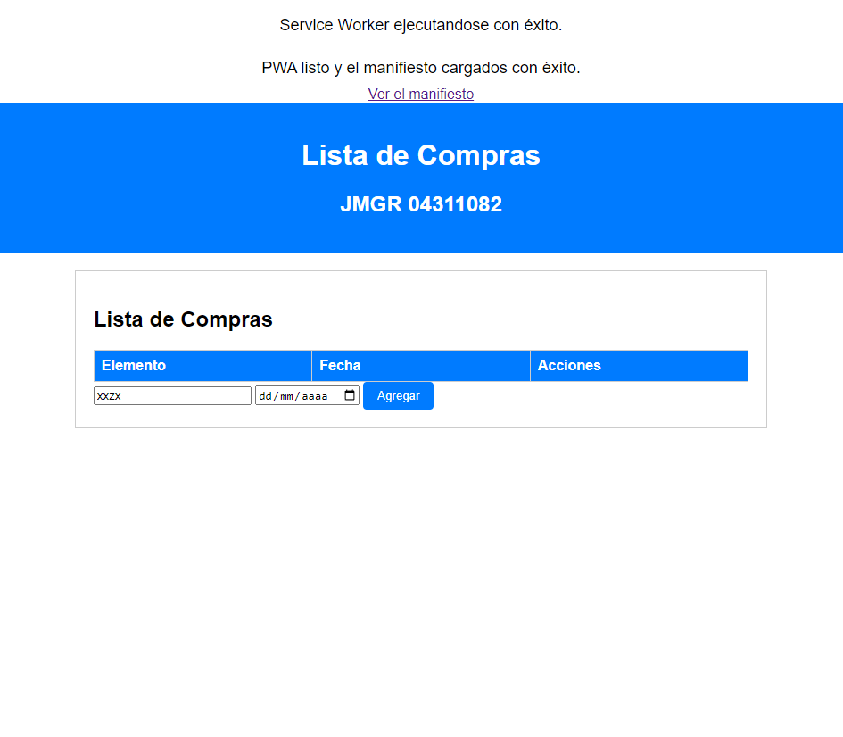
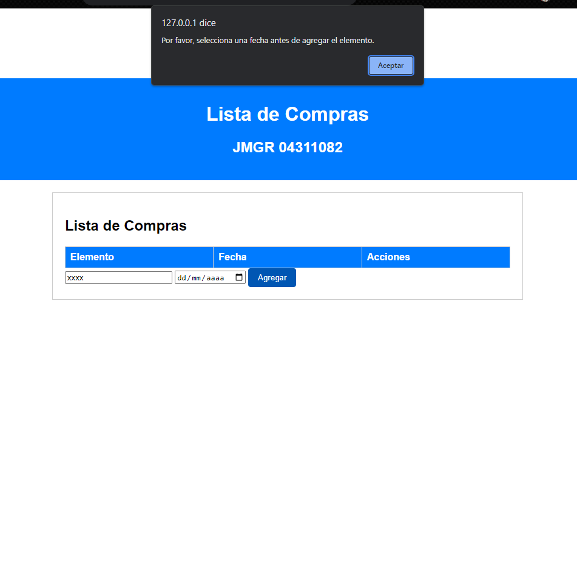

# Lista de Compras PWA

Esta Progressive Web App (PWA) te permite gestionar tu lista de compras de manera fácil y eficiente. Puedes agregar productos, asignar fechas de compra y eliminar elementos de tu lista. Además, la PWA funciona en línea y fuera de línea, lo que te permite acceder a tu lista de compras en cualquier momento.

## Características

- Agregar productos a la lista de compras.
- Asignar fechas de compra a los productos.
- Eliminar productos de la lista.
- Funcionamiento fuera de línea: la PWA almacena tus datos localmente para su acceso sin conexión.
- Caché del manifiesto: el manifiesto de la PWA se almacena en caché para un funcionamiento más rápido.

## Capturas de Pantalla

## Instalación

1. Clona este repositorio o descarga el código fuente desde :  https://github.com/mrgastelum/listacompras
2. Abre el archivo "index.html" en tu navegador web.

## Uso

1. Agrega productos a la lista ingresando su nombre y asignando una fecha de compra.
2. Haz clic en "Agregar" para incluir el producto en la lista.
3. Puedes eliminar productos haciendo clic en el botón "Eliminar" junto a cada elemento.
4. El manifiesto se carga automáticamente para proporcionar una experiencia PWA.

## Tecnologías Utilizadas

- HTML5
- CSS3
- JavaScript
- Service Worker
- Manifesto Web App

## Contribuciones

Si deseas contribuir a este proyecto, ¡te damos la bienvenida! Puedes abrir problemas (issues) o enviar solicitudes de extracción (pull requests).

## Licencia

Este proyecto está bajo la Licencia MIT. Puedes ver los detalles en el archivo [LICENSE](LICENSE).

## Autor

Creado por [Jesus Mario Gastelum Rochin] - [UTH] - [EXP:04311082]